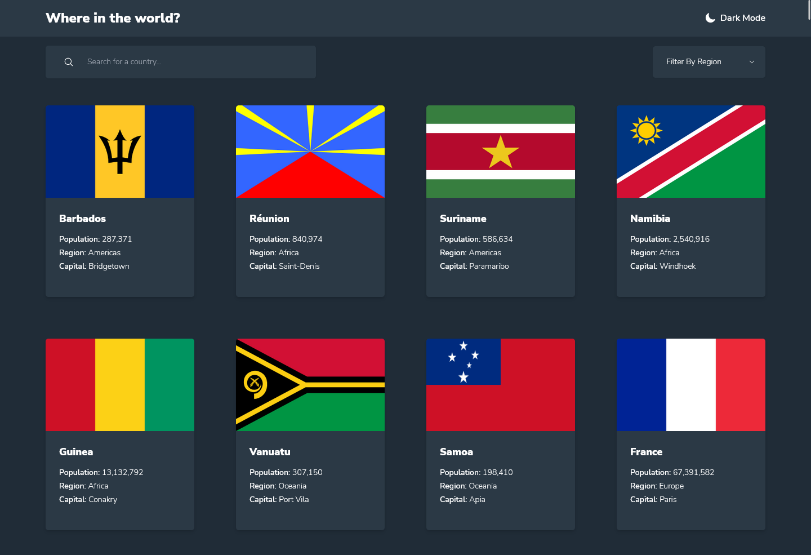
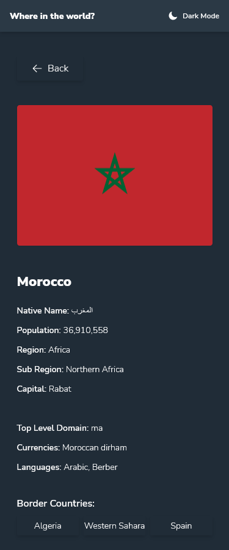
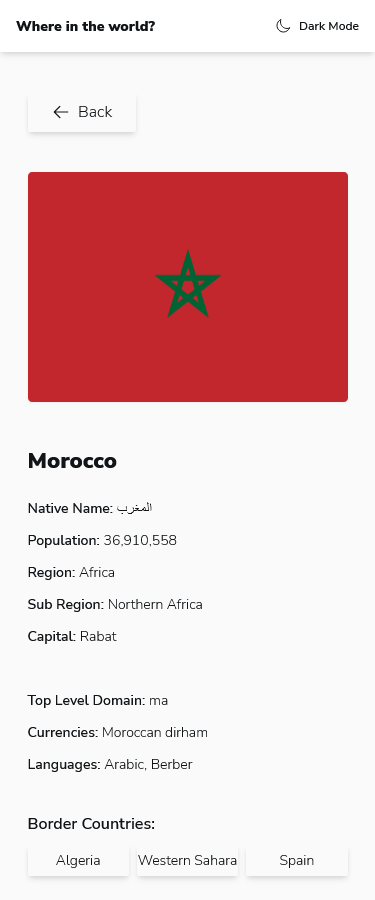

# Frontend Mentor - REST Countries API with color theme switcher solution

This is a solution to the [REST Countries API with color theme switcher challenge on Frontend Mentor](https://www.frontendmentor.io/challenges/rest-countries-api-with-color-theme-switcher-5cacc469fec04111f7b848ca). Frontend Mentor challenges help you improve your coding skills by building realistic projects. 

## Table of contents

- [Overview](#overview)
  - [The challenge](#the-challenge)
  - [Screenshot](#screenshot)
  - [Links](#links)
- [My process](#my-process)
  - [Built with](#built-with)
  - [What I learned](#what-i-learned)
  - [Difficulties](#difficulties)
  - [Useful resources](#useful-resources)
- [Author](#author)
- [Acknowledgments](#acknowledgments)

## Overview

### The challenge

Users should be able to:

- See all countries from the API on the homepage
- Search for a country using an `input` field
- Filter countries by region
- Click on a country to see more detailed information on a separate page
- Click through to the border countries on the detail page
- Toggle the color scheme between light and dark mode 

### Screenshot

#### Desktop View :

#### Mobile View (Dark Mode) :

#### Mobile View (Light Mode) :

### Links

- [Solution URL](https://your-solution-url.com)
- [Live Site URL](https://your-live-site-url.com)

## My process

### Built with

- [React](https://reactjs.org/) - JS library
- [Tailwind CSS](https://tailwindcss.com/) - For styles
- [Redux Toolkit](https://redux-toolkit.js.org/) - State management
- [React Router](https://reactrouter.com/) - For routing
- [Hero Icons](https://heroicons.com/) - For icons

### What I learned

During my project, I acquired a number of new skills and techniques that I found to be invaluable in web development.  I've delved deeper into React Hooks such as useEffect, useMemo, and useState, which have enhanced my ability to manipulate state and manage side-effects in React applications. I've also gained a better understanding of React Routers and how to implement routing in a React application. Additionally, I've learned how to utilize localStorage to store key-value pairs for persistence across sessions, a valuable tool in web development. Lastly, I've become more familiar with the Redux toolkit, which has enabled me to streamline my state management and improve my application's scalability. Overall, these learnings have helped me to improve my proficiency in web development and to build more robust and efficient applications.

### Difficulties

During the development of my project, I encountered several challenges that I had to overcome. One of the most difficult issues I faced was a bug where navigating to a country details page and then attempting to access its border countries resulted in an URL change, but the content of the page remained the same. Initially, I believed the problem was with my routing method, so I spent a lot of time trying to fix it. However, after an extended debugging process, I discovered that the issue was actually caused by not including the dynamic parameter in the dependency array of my useEffect hook. To address this, I switched to using the useMemo hook, which ultimately solved the problem. While resolving this issue, I am now confused about the difference between the useMemo and useEffect hooks. I would like to learn more about the differences between these two hooks and when it is appropriate to use each one.

In addition to the aforementioned challenge, I encountered another difficulty during the development of my project when implementing the filter feature. I attempted to create this feature without relying on any online tutorials, but I quickly discovered that my approach was flawed. Specifically, when clicking on a country and then returning to the home page, the filter did not reset, even though the search input was empty. This was a particularly frustrating issue as I could not figure out how to solve it on my own. However, I was able to overcome this obstacle after watching a video tutorial by Web Dev Simplified, which clearly explained the correct approach to implementing the search feature. This video helped me to refactor my code and ultimately fix the bug.

## Author

- Frontend Mentor - [@Earthyyy](https://www.frontendmentor.io/profile/Earthyyy)
- Github - [@Earthyy](https://github.com/Earthyyy)

## Acknowledgments

Big Thanks <3 to :

* [Web Dev Simplified](https://www.youtube.com/channel/UCFbNIlppjAuEX4znoulh0Cw)
* [Frontend Mentor](https://www.frontendmentor.io/)
